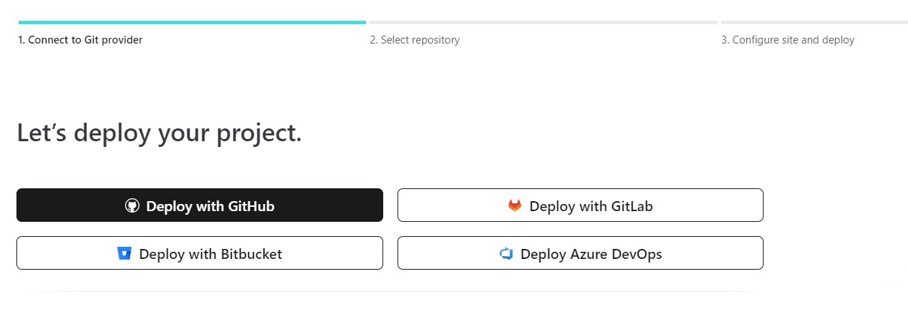
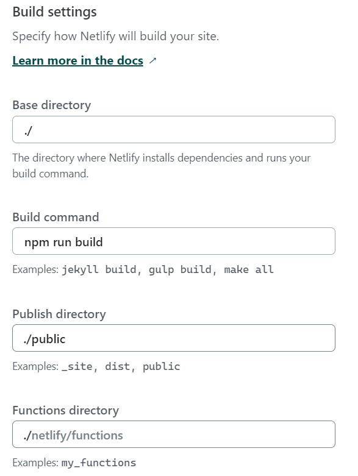

_Looking for a shareable component template? Go here --> [sveltejs/component-template](https://github.com/sveltejs/component-template)_

---

# svelte app

This is a project template for [Svelte](https://svelte.dev) apps. It lives at https://github.com/sveltejs/template.

To create a new project based on this template using [degit](https://github.com/Rich-Harris/degit):

```bash
npx degit sveltejs/template svelte-app
cd svelte-app
```

_Note that you will need to have [Node.js](https://nodejs.org) installed._

## Get started

Install the dependencies...

```bash
cd svelte-app
npm install
```

...then start [Rollup](https://rollupjs.org):

```bash
npm run dev
```

Navigate to [localhost:9000](http://localhost:9000). You should see your app running. Edit a component file in `src`, save it, and reload the page to see your changes.

By default, the server will only respond to requests from localhost. To allow connections from other computers, edit the `sirv` commands in package.json to include the option `--host 0.0.0.0`.

## Building and running in production mode

To create an optimised version of the app:

```bash
npm run build
```

You can run the newly built app with `npm run start`. This uses [sirv](https://github.com/lukeed/sirv), which is included in your package.json's `dependencies` so that the app will work when you deploy to platforms like [Heroku](https://heroku.com).

## Single-page app mode

By default, sirv will only respond to requests that match files in `public`. This is to maximise compatibility with static fileservers, allowing you to deploy your app anywhere.

If you're building a single-page app (SPA) with multiple routes, sirv needs to be able to respond to requests for _any_ path. You can make it so by editing the `"start"` command in package.json:

```js
"start": "sirv public --single"
```

## Deploying to the web

### With [now](https://zeit.co/now)

Install `now` if you haven't already:

```bash
npm install -g now
```

Then, from within your project folder:

```bash
cd public
now deploy --name my-project
```

As an alternative, use the [Now desktop client](https://zeit.co/download) and simply drag the unzipped project folder to the taskbar icon.

### With [surge](https://surge.sh/)

Install `surge` if you haven't already:

```bash
npm install -g surge
```

Then, from within your project folder:

```bash
npm run build
surge public my-project.surge.sh
```

### With [Netlify](https://www.netlify.com/)

Create a new repository on GitHub and push the code to it. For a step-by-step guide to import source code to GitHub, you may read this [guide](https://docs.github.com/en/migrations/importing-source-code/using-the-command-line-to-import-source-code/adding-locally-hosted-code-to-github).

Once you have your code on GitHub, you may build and deploy the site onto Netlify.

Select "Import an existing project" from "Add new site" and then "Deploy with GitHub".



On the build page, enter `npm run build` as the "Build command" and `./public` as the "Publish directory" and click on "Deploy Site".



After deploying the site, you will receive a URL. Keep in mind that accessing the website directly will display an empty page. This behavior is expected as the site is not intended for direct viewing.